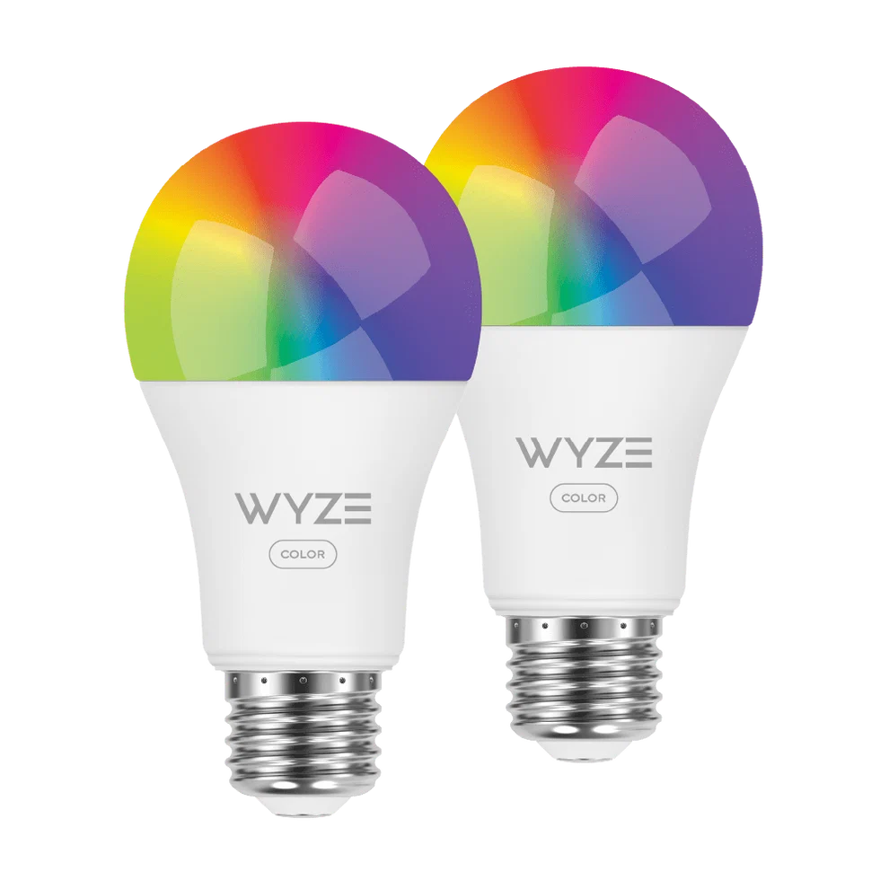

# wyze-bulb-color-pwned
Wireless exploit for the Wyze WLPA19CV2 color bulb

## Overview

The Wyze Color WLPA19CV2 bulbs have a factory test mode which allows a custom OTA image to be flashed wirelessly through a specific sequence of power cycling.

## Usage

*"To break the lock on this ESP32, we're going to use an ESP32"*

1. Flash `wyze-hijack-ap` to an ESP32S3. Keep it powered on near the bulb.
    - Easy: [wyze-hijack-ap Web Flasher](https://nickdaria.github.io/wyze-bulb-color-pwned/)
    - Advanced: build from source, idf.py
2. Put the bulb into something easy to switch like a wall switched circuit or a power strip
3. Start with your bulb fresh out of the box OR factory reset. It should be pulsing green when powered on.
4. Repeat the following until you see the light turn blue, then leave it on
    - Turn power on until you see the green light fade on, immediately shut it back off
    - Keep power off for 5 seconds
5. After ~17 cycles, the light should be blue for a moment. Sit tight while the exploit runs
6. After ~30 seconds, the exploit should be complete and your bulb should turn purple to indicate the wyze-loader payload is running

Success!

The bulb now boots to the wyze-loader, which hosts an AP called wyze-loader_XXXXXX. Connect to this AP and navigate to [http://192.168.4.1](http://192.168.4.1).

You can upload whatever partition-compatible firmware you would like. I plan to make a Tasmota variant.

## Why

I bought these at Microcenter and don't like that you need the cloud for control with Home Assistant. I wanted to flash Tasmota but the board was different.

Ironically, I started this to avoid spending half an hour soldering and instead wasted a weekend reverse engineering and developing.

## How

See [docs/METHODOLOGY.md](docs/METHODOLOGY.md)

## Todo

See [docs/TODO.md](docs/TODO.md)