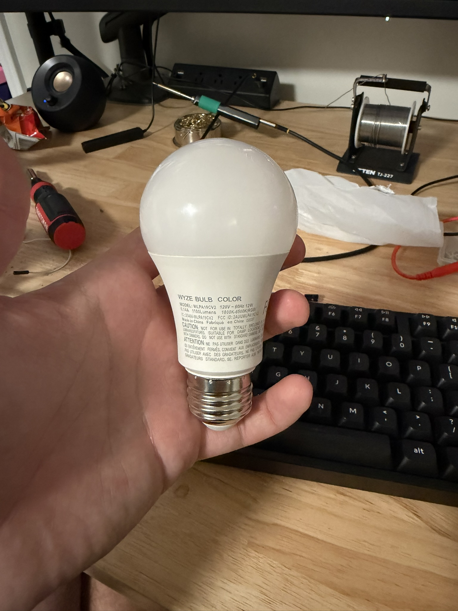
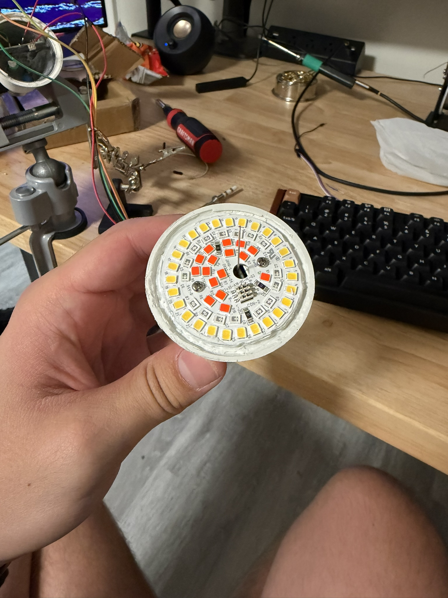
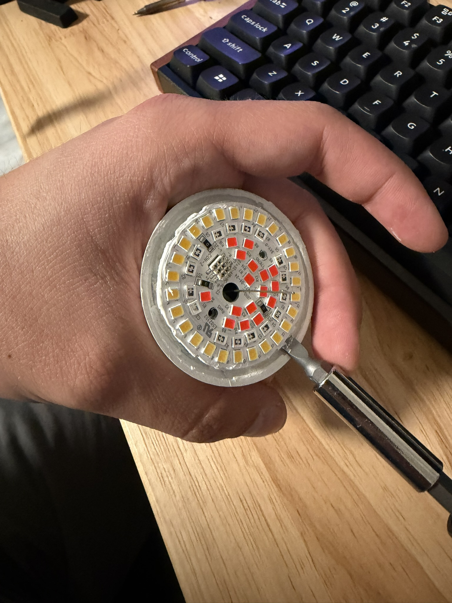
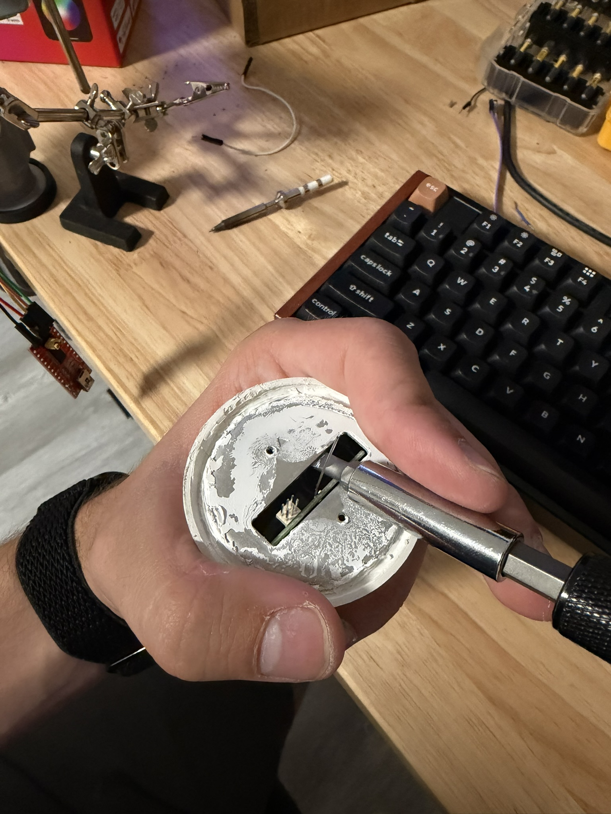
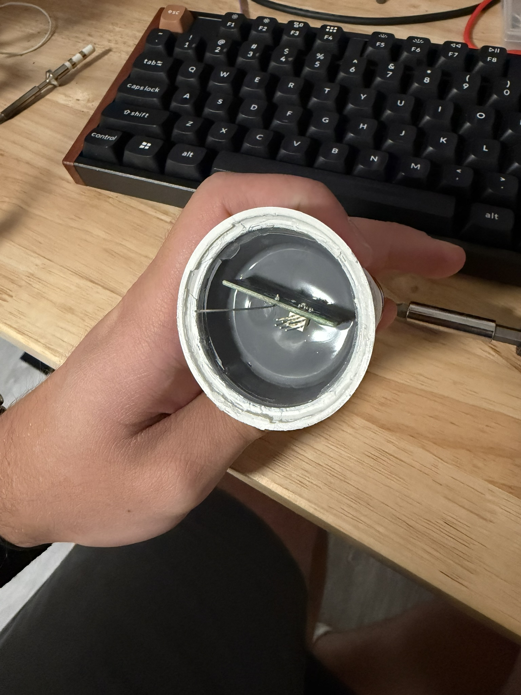
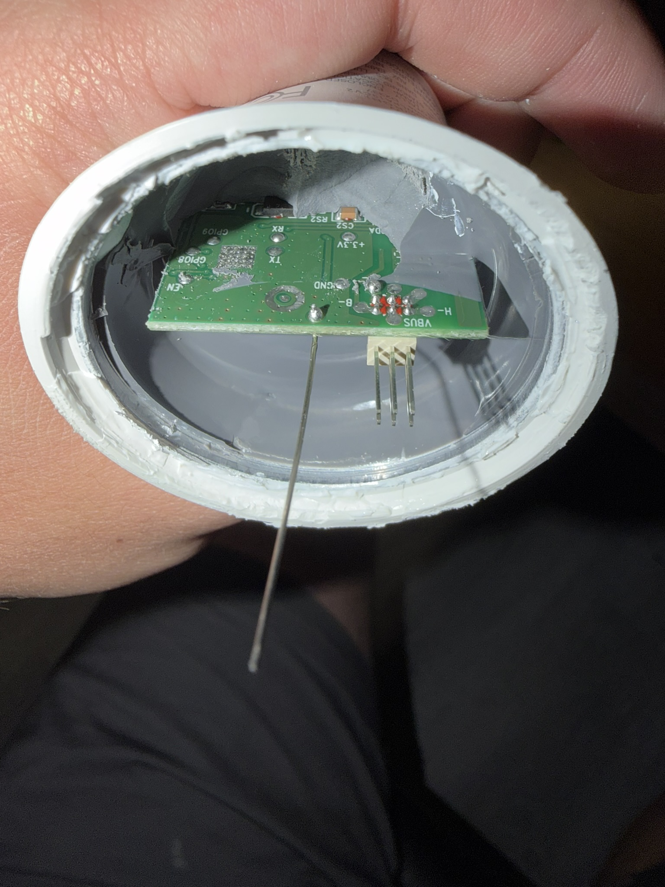

# Disassembly

1. Pull upwards on the transparent part of the bulb to break the epoxy and remove it.

    

2. Unscrew both screws and pry out the LED board which is connected via long terminals in a through-hole style connector.

    

3. Pry out the shield

    

4. Start removing the potting compound on the side of the PCB without the vertical connector and antenna

    

5. You should be able to expose the pads below:
    - GPIO9
    - GPIO8
    - TX
    - RX
    - 3V3
    - GND
    - EN

    