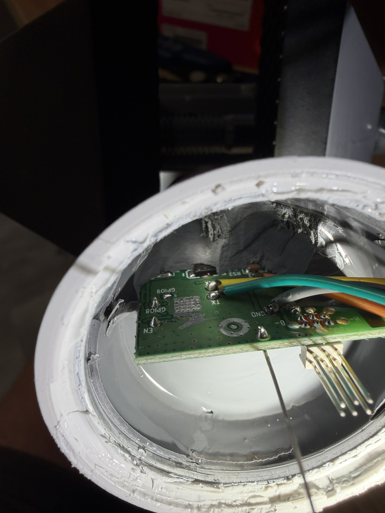

# Overview

The attack workflow here was pretty typical. Extract firmware, analyze code paths that result in code execution, duplicate conditions.

## Goal

Obtain code execution without disassembling all of my bulbs. I know it's probably easy to do a serial write and I certainly wasted more time but I really hate opening and soldering these.

## Background

While I was unable to find any images or resources on my specific model, previous iterations of Tasmota-supported Wyze bulbs did not have any of the ESP32 security features enabled, used an unmodified ESP-IDF bootloader, and programming pads were available. I figured this would likely hold true.

Some other behaviors of interest:

- These are factory reset by toggling the power to them a certain number of times
- These launch an AP (ESP_xxxxxxx) when power is toggled the same way 5 times - however this is fairly secure and only for provisioning Wi-Fi creds

## Physical

See [docs/DISASSEMBLY.md](../docs/DISASSEMBLY.md)

## Connection



- GPIO9 to FTDI GND
- GPIO8 to FTDI 3V3
- TX to FTDI RX
- RX to FTDI TX
- 3V3 to FTDI 3V3
- GND to FTDI GND
- EN button (NO) to ground - used when entering boot or "power cycling" bench


If you know the ESP32(C3), you know what those pins mean. GPIO9/GPIO8 are your strapping pins read by the bootrom. TX/RX are your UART, EN is your RST, and 3V3/GND provide power.

Unfortunately, you do need to assert that GPIO8. Without it, you will get into boot but it is strapped to talk via native USB which isn't exposed.

## Recon

Once wiring was settled, I simply grounded EN a few times and saw the applications log start pouring out. What I really cared about though was the chip.


### Identification

```
ESP-ROM:esp32c3-api1-20210207
```

Once I saw this, I simply ran an esptool command to ID the chip and ensure we could run a stub

```
esptool v5.3.1
Connected to ESP32-C3 on COM3:
Chip type:          ESP32-C3 (QFN32) (revision v0.3)
Features:           Wi-Fi, BT 5 (LE), Single Core, 160MHz, Embedded Flash 4MB (XMC)
Crystal frequency:  40MHz
MAC:                68:67:25:47:66:f8

Stub flasher running.

Warning: ESP32-C3 has no chip ID. Reading MAC address instead.
MAC:                68:67:25:47:66:f8
```

### Secure Boot Status

The only thing that would make this project difficult is if Wyze started using secure chip features. Thankfully, this was not the case.

See [../logs/normal/espefuse.txt](../logs/normal/espefuse.txt)

### Firmware Extraction

This was tricker than usual, probably because my wiring was horrible (ran out of dupont cables lol). Thankfully, the ESP stub + esptool checksum reads and catch them for you, but most of my reads were junk.

My solution was a script which broke the read into smaller chunks and then concatenated them at the end. This way it could gracefully handle transport failures without restarting the entire thing. This worked well, and curiously the failure points were all in the same address range around halfway through the read.

### Reverse Engineering

The first thing I did was evaluated the partition table binary (@ 0x8000) and extracted the invidual firmware binaries from the full read. I noticed a few things:

- Used the traditional ESP dual-OTA partition scheme
- OTA_1 was erased
- The bootloader appeared to be a completely unmodified Espressif IDF bootloader

Knowing that this likely lacked advanced security, I turned my attention to the OTA_0 partition (full image: 0x10000--0x1E0000). Thankfully, these RISC-V ESP32s are MUCH easier to spin up in Ghidra than the older Xtensa stuff. 

Another nice thing about ESP32s specifically is that even when you don't have labels or exports, ESP_LOGx leaves begind a ton of calls which make it easy to get your bearings. My general approach was to find ESP calls of interest (esp_ota, esp_http, etc). Because of ESP_LOGx, I was able to search for strings from the debug output and label ESP-IDF function calls.

#### Points of interest

- 0x40390fb4 - esp log write
- 0x4201c42a - OTA task
- 0x4207c488 - esp_ota_begin
- 0x4207c562 - esp_ota_write

The primary goal here is the OTA mechanism that allows us to stage a program in the other OTA slot and switch the ESP-IDF counter in otadata so the bootloader will use our code.

There were only two paths I found to trigger the OTA task:

1. Cloud fetch from AWS (with HTTPS/cert validation)
2. A really funny rain dance

### Factory Test Mode

While working backwards from the OTA task I found a whole communication system in the bulb for factory use (spawned @ 0x42016056)

If you check out 0x42016ae8 (0x420169c6 effectively gets the number of sequential power cycles + resets after threshold), you will see that a function starts to get called after 17 power cycles. 

Effectively, when the light bulb is toggled 17 times with less than 3s power-on time between them, it begins scanning for a network (SSID: ASDFGHJKLzxcvb, PASS: 0x82562647). Once connected, it enters what it calls "FAC TEST", which I assume is factory test.

In this mode, the bulb regularly broadcasts a bunch of information about itself. It is also available for UDP commands on port 22223. Most interestingly, this handler (@ 0x42015bcc) accepts a very interesting request `hap upgrade {something}`. As it turns out, that is a download URL. There is also a built-in path used when no URL is provided which I started with before I realized the arg: `http://192.168.3.168:8070/wyze_iot_service.bin`

This is WAY easier to do on the bench with the EN pin. The bulb power supply keeps 3V3 powered on for a good bit after turning power off, which means you have to be super deliberate in the actual attack instead of just spamming a button on the bench.

## Attack

All I had to do was enter factory test mode via power cycling, have the bulb connect, fire the upgrade command, and serve the OTA image file. 

I initially got this working with my own machine, a spare AP, and a complicated configuration on my Microtik router to use the built-in OTA address. Eventually though, I realized that all we need to break into this ESP32 was another ESP32! As such, `wyze-hijack-ap` was born. It exists to capture this functionality and upload the `wyze-loader` payload.