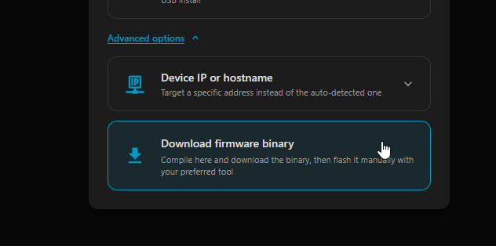
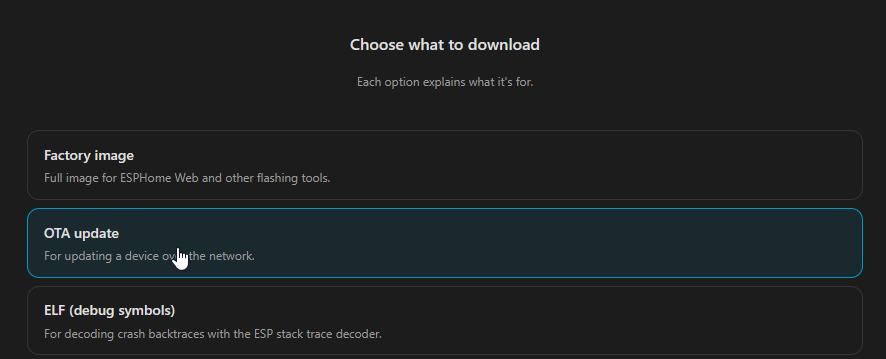
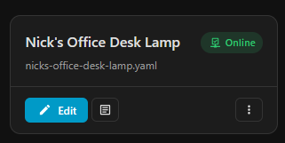

# ESPHome

## Preparation

1. Create a new ESPHome device with an empty configuration
2. Paste in the provided [config.yaml](./config.yaml)
3. Modify the device name and other variables
4. If it asks what board you're using, select Generic ESP32C3

## Flashing

1. Execute the attack as detailed in the [README](../../README.md)
2. Install > Advanced options 

    

3. Download OTA update binary

    

4. Upload the OTA image and wait for the log output asserting completion, this will unlock the buttons for the next steps
5. Change OTA target

    

6. Reboot

    

Congrats! Your bulb is now on ESPHome!

## Reverting

To revert, simply generate a config with the web server enabled and then push either the wyze-loader binary or the orignal Wyze firmware binary to the device.