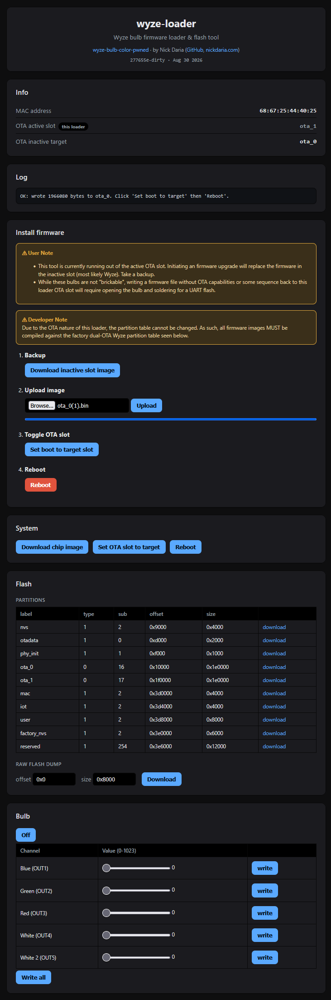

# wyze-loader

Minimal loader program bundled with ap-hijack which allows the user to backup flash, upload a new OTA image (replacing the wyze one), and switch OTA slots

1. While not "brickable" if you flash re-exploitable Wyze or custom OTA-able images, you can get stuck in a state which can only be physically recovered if you upload good code without an OTA method.
2. The partition layout is stuck to Wyze's. This is not ideal for ESPHome but you can still generate an OTA image and upload it
3. The Wi-fi AP will cause a brownout bootloop if you're running off of an incapable supply (like my FTDI) on the bench.

NOTE: At the very least, you should add some mechanism to switch the OTA slot back to wyze-loader if you are developing custom firmware without an OTA framework.

## Usage

1. Flash via `wyze-ap-hijack` or write using debug pads + esptool
2. Backup your full image
3. Upload your desired app image to the target OTA slot (the one not running wyze-loader)
4. Press "Set boot to target", then reboot on success

## Notes

- This is a dangerous tool. There are no actual signature checks, it just relies on the `esp_image_verify` checks.
- You must fit your file in the OTA size (less than 1.875MB)

## HTTP Endpoints

If you want to automate this for whatever reason, everything is done via endpoints.

| Method | Endpoint | Description |
|---|---|---|
| GET | / | UI |
| GET | /info | {"running","target","mac","version","date","bonus"} |
| GET | /parts | JSON partition table |
| GET | /dump?name=label | Download a partition |
| GET | /dump?offset=0x0&size=0x8000 | Download a raw flash region (filename suffixed with MAC) |
| POST | /ota | Raw body = app image, placed into inactive OTA slot |
| POST | /setboot | Set boot partition to last upload |
| POST | /setboot?name=ota_1 | Set boot partition |
| POST | /reboot | Restart |
| POST | /bulb/init | Init I2C, enable driver, set channel currents |
| POST | /bulb/write?ch=N&val=V | Write one bulb channel (ch 0-4, val 0-1023) |
| GET | /bulb/channels | Known bulb channel map [{"idx","name"}] |

## Screenshot
